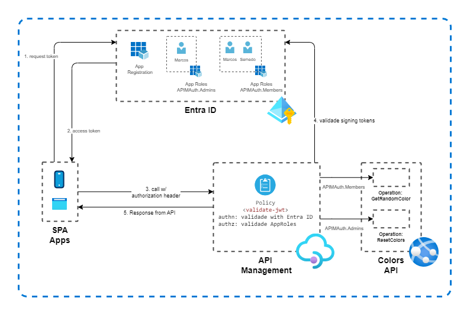
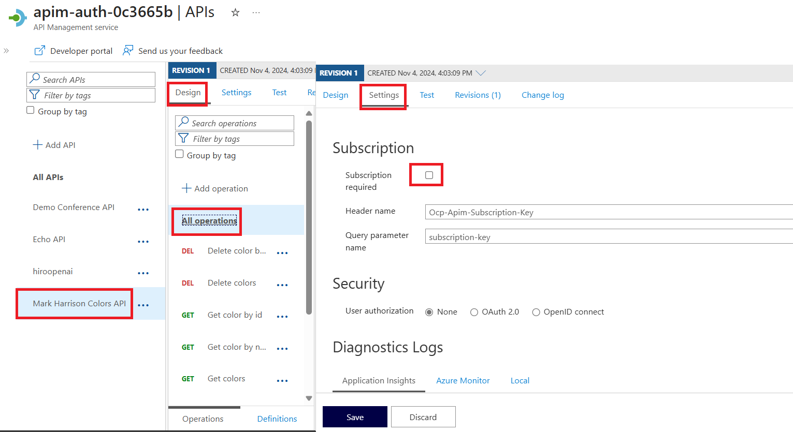
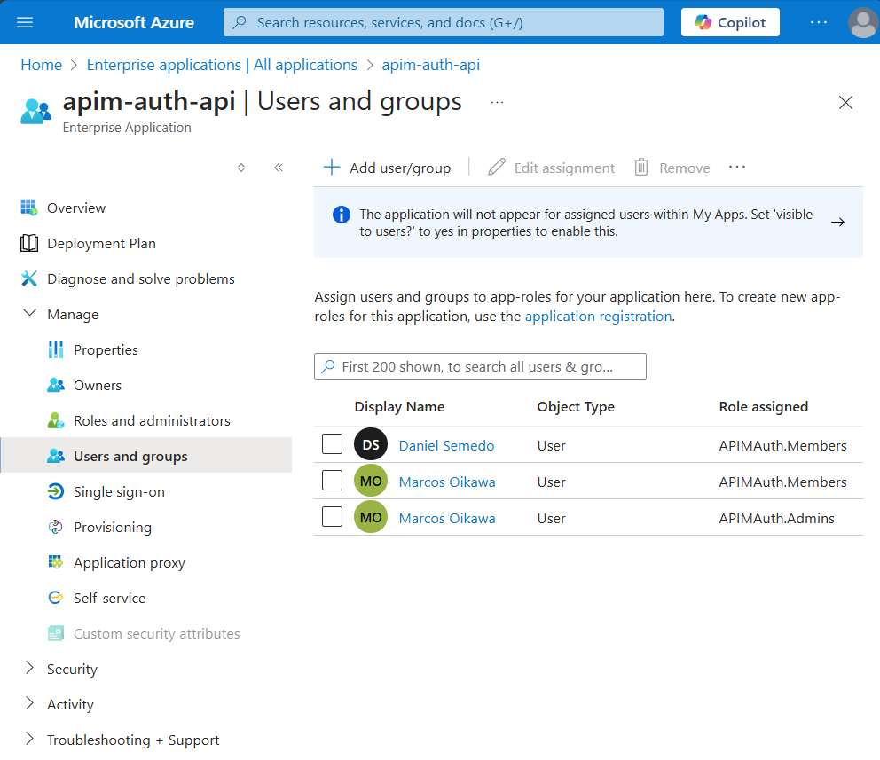
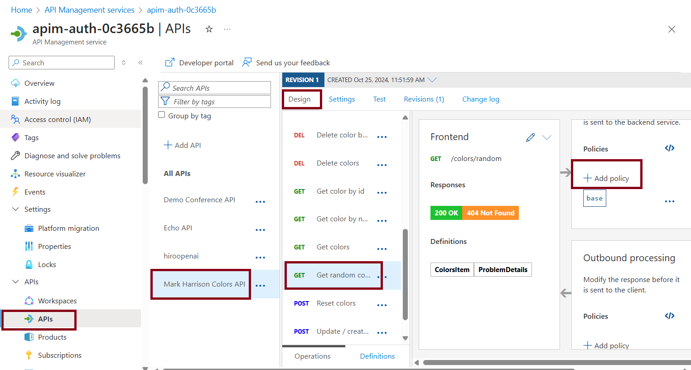
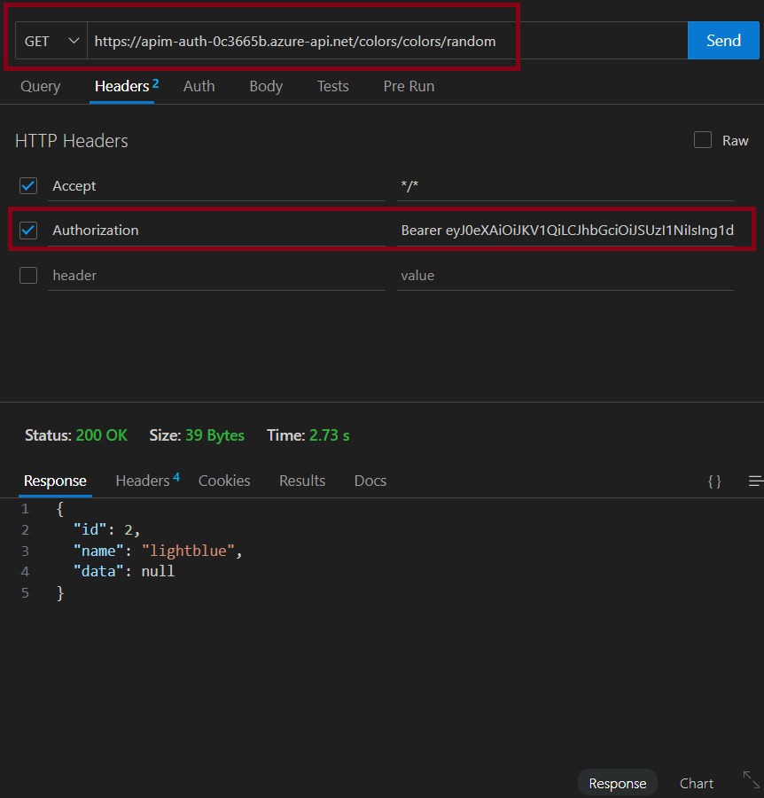

# API Authentication with API Management (APIM) using APIM Policies with Entra ID and App Roles 

 
 
[](https://azure.microsoft.com)


## Scenario

The main objective of this LAB is to demonstrate how Azure API Management (APIM) can centralized authentication and authorizaton of APIs using Entra ID using APIM Policy (validate-jwt) and App Roles of Entra ID. 

This is very usefull when you have legacy APIs, APIs with no OAuth 2.0 / OIDC or even if you need to centralized management of authentication and authentication in one single pane 
of glass


## Architecture
For this LAB, given a public API (Colors API), with 2 Operations ("Get random color" and "Reset colors") we will now add Authentication (AuthN) and Authorization (AuthZ), requiring a role of Admin to access "Reset colors" Operation, and role of Member to call "Get random color" Operation of API.

To do this, we will create 2 App Roles, APIMAuth.Admins and APIMAuth.Members, and assign users to this App Roles. In APIM, we will import the API and will create Policies (validate-jwt) for 2 operations: "Get random color" and "Reset colors". For "Reset colors" we will require APIMAuth.Admins App Role, and for "Get random color" we will require APIMAuth.Members App Role.



## Prerequisites

- An Azure account with an active subscription. [Create an account for free](https://azure.microsoft.com/free/?WT.mc_id=A261C142F).

## Create APIM Environment
Open Azure Portal and click on Cloud Shell to run this scripts to Create API Management

Variable block
```bash
resourceGroup="apim-auth"
ident=$(az account show --query id --output tsv)
ident+=$(echo $resourceGroup)
randomIdentifier=$(echo $ident | md5sum | cut -c 1-7)
apim="$resourceGroup-$randomIdentifier"


```

Create Resource Group
```bash
az group create \
    --name $resourceGroup \
    --location brazilsouth
```

Ceate an API Management
```bash
az apim create --name $apim --resource-group $resourceGroup \
  --publisher-name Contoso --sku-name Developer --publisher-email admin@contoso.com \
  --no-wait
```

## Import an API in APIM
For this demo, we will use Colors API (https://colors-api.azurewebsites.net), a backend API for demos proposed, provided by Mark Harrison. Use this guide [Tutorial: Import and publish your first API](https://learn.microsoft.com/en-us/azure/api-management/import-and-publish) for more details if need to import API to your API Management.


1. In the Azure portal, search for and select API Management services.
1. On the API Management services page, select your API Management instance.
1. In the left navigation of your API Management instance, select APIs.
1. Select the **OpenAPI** tile.
1. In the Create from OpenAPI specification window, select Full.
1. Enter the values from the following table.
1. Click Create


|Setting|Value|
|-------|-----|
|**OpenAPI specification**|*https:\//colors-api.azurewebsites.net/swagger/v1/swagger.json*|
|**Display name**|After you enter the OpenAPI specification URL, API Management fills out this field based on the JSON.|
|**Name**|After you enter the OpenAPI specification URL, API Management fills out this field based on the JSON.|
|**Products**|**Unlimited** / **Starter**|
|**Gateways**|**Managed**|


After you import, lets uncheck the option of subscription required. 

> In this case, for simplicity of demonstration, we will not use Subscrition feature of APIM, but you can use, on top of Entra ID Authentication and Authorization.

1. Go to the API imported / All Operations / Settings tab.
1. Uncheck "Subscription required"
1. Click Save



## Register the API App

### Create the API entity on Microsoft Entra ID

1. Navigate to the [Azure portal](https://portal.azure.com) and select the **Microsoft Entra ID** service.
1. Select the **App Registrations** blade on the left, then select **New registration**.
1. In the **Register an application page** that appears, enter your application's registration information:

|Setting|Value|
|-------|-----|
|Name|apim-auth-api|
|Supported account types|Accounts in this organizational directory only|

Select **Register** to create the application.

In the **Overview** blade, find and note the **Application (client) ID** and  **Directory (tenant) ID**. Keep these values for future use.


### Expose the  API and Publish Delegated Permissions

In the left menu, in **Manage section**, select the **Expose an API** blade

>This the page where you can publish the permission as an API for which client applications can obtain [access tokens](https://aka.ms/access-tokens) for. The first thing that we need to do is to declare the unique [resource](https://docs.microsoft.com/azure/active-directory/develop/v2-oauth2-auth-code-flow) URI that the clients will be using to obtain access tokens for this API. 

Declare an resource URI(Application ID URI), follow the following steps:

1. Select **Add** next to the **Application ID URI** to generate a URI that is unique for this app.     
1. For this sample, accept the proposed Application ID URI (`api://{clientId}`) by selecting **Save**. Read more about Application ID URI at [Validation differences by supported account types \(signInAudience\)](https://docs.microsoft.com/azure/active-directory/develop/supported-accounts-validation).

#### Publish Delegated Permissions
In the same page, add a scope to you App Registration. 

>All APIs must publish a minimum of one [scope](https://docs.microsoft.com/azure/active-directory/develop/v2-oauth2-auth-code-flow#request-an-authorization-code), also called [Delegated Permission](https://docs.microsoft.com/azure/active-directory/develop/v2-permissions-and-consent#permission-types), for the client's to obtain an access token for a *user* successfully. 

To publish a scope, follow these steps:
1. Select **Add a scope** button open the **Add a scope** screen and Enter the values as indicated below:

|Setting|Value|Comment|
|-------|-----|---|
|Scope name|APIMAuth.Read|(case-sensitive)|
|Who can consent?|Admins and users||
|Admin consent display name|Allow the admins of the app apim-auth to read data||
|Admin consent description|Allows the admins to read the signed-in users data||
|User consent display name|Allow Users to read data items as yourself||
|User consent description|Allow the users to read data on your behalf||
|State|Enabled||

## Create App Roles
[App Roles](https://docs.microsoft.com/azure/active-directory/develop/howto-add-app-roles-in-azure-ad-apps#assign-app-roles-to-applications) is the core of RBAC for APIs. 
We will create two App Roles, one representing "Member Access", and other one representing "Admin" access.

#### Create the App Role: APIMAuth.Members
1. Still on the same app registration, select the **App Roles** blade to the left.
1. Select **Create app role**. Create a App Role with the folowing values:

|Setting|Value|
|-------|-----|
|Display name|APIMAuth.Members|
|Allowed member types|Both (Users/Groups + Applications)|
|Value|APIMAuth.Members|
|Description|Allow users to access members permissions of API, whitch is: Can call **"Get random color"** operation|
|Do you want to enable this app role?|checked|

3. Select **Apply** to save your changes.

#### Create the App Role: APIMAuth.Admins

Repeat the steps above for another app permission named **APIMAuth.Admins**

|Setting|Value|
|-------|-----|
|Display name|APIMAuth.Admins|
|Allowed member types|Both (Users/Groups + Applications)|
|Value|APIMAuth.Admins|
|Description|Allow users to access admin permissions of API, whicth is can Post **"Reset colors"** operation|
|Do you want to enable this app role?|checked|

## Giving users permissions
Next, we will assign users to preview created App Roles.
You must have at least two users in your Microsoft Entra ID Tenant, to give one the access of Member, and other the access of Admin.
1. Still on App Registration pane, on **Overview**, click on "Managed application in local directory", to go to the Enterprise Application pane.

1. In the Enterprise Application Pane, in Manage section, go to **Users and groups**, **+ Add user/group**, select a user and select just APIM.Members App Role. Click on Select, and then Assign.
1. Do the seme for another user, including this time, the APIM.Admins and APIM.Members App Role. The configuration will be something similar to this:

In this example, Marcos will have the "Admin" role, and Daniel will have "Member" role.

## Configure APIM According App Roles
In this sample, we will consider that Members can get random colors, but not reset colors. To do so, we will configure 2 operations policies, one for **Get random color** operation, and another one for **Reset colors** operation.

### "Get random color" Operation Policy: Validade JWT

1. In Azure Portal, go to API Management, click on instance created.
1. In the left panel, go to API, click on API just imported, **"Get random color"** operation. In Inbound policy, click on **+ Add policy**.

1. Select "Validade JWT" Policy.


4. Fill the values with values of application, described in the table.

>Note that you will need the values kept in Microsoft Entra ID / App Registration: **Application (client) ID**, and **Directory (tenant) ID** values.

|Setting|Value|
|-------|-----|
|**Header name**|Authorization|
|**Failed validation HTTP code**| Leave with 401 - Unauthorized|
|**Failed validation error message**| Unauthorized due APIM Policy |
|**Audiences**|api://[*your-app-id*] 
||*[your-app-id]*|
|**Required claims - Name**|roles|
|**Required claims - Match**|Any claim|
|**Required claims - Value**|APIMAuth.Members|
|**Open ID URLs** |https://login.microsoftonline.com/[*your-tenant-id*]/v2.0/.well-known/openid-configuration|

5. Click Save.


6. Open the policy and add the issuer xml section, below to audiences section

```xml
    <issuers>
        <issuer>https://sts.windows.net/[your-tenant-id]/</issuer>
    </issuers>
```
Final result will be something smimilar to this:


### "Reset colors" Operation Policy: Validade JWT
Repeat the process for **Reset colors** operation, using **APIMAuth.Admins** Role.


## Run and Test
At this point you have all setup with your API to be consumed via Entra ID Authentication and Authorization. You can now call the API with a apropriate Barear token aquired against Microsoft Entra ID, with the users you defined at App Roles.

For demonstration proposes in this case, we will aquire a Bearer token via CLi and will use this token to call the APIs. Acording to users we defined in Users / App Roles, users will have access to APIs or not.

### Set up Azure CLI

Have Azure CLI installed on your machine. Your can setup folowing this guide: [How to install the Azure CLI](https://learn.microsoft.com/en-us/cli/azure/install-azure-cli).

Execute on cli:

```bash
az login --use-device-code
```

Follow the instructions to login with device code with the first user you define in the Microsoft Entra ID / App Roles, with APIMAuth.Members


Next, execute this command:
```bash
az account get-access-token --resource api://*your-app-id*
```

You should see a message like this, saying that the CLi console do not have a consent of admin to ask a token. The Message also give you the CLi ID.


To to this consent, go to Microsoft Entra ID / App Registrations / All application tab / apim-auth-api App.
Go to Expose API (same pane of before section), in Authorized client applicaitons, click on +Add a client application and add the CLi ID captured on error message before, selecting the scope previously created


Now, execute again the commands:

```bash
az logout
az login --use-device-code
```
And try to get again the token:

```bash
az account get-access-token --resource api://*your-app-id*
```
You now should get the access token:


If you open https://jwt.ms/ and put the token you will see the claims that Entra ID returned to application, and also will see the Roles that this user was assinged.
In my case, the user semedo@oikawa.dev.br was assigned just with APIMAuth.Members role.


### Calling **"Get random color"** Endpoint

Now you can call the API using this Barear token. 
You can see the base endpoint your API in API Management / API / Conference API / Settings / Base URL
Get the base URL and add the /sessions and /speakers

It will be something like: 

**https://apim-auth-[yourRandom].azure-api.net/colors/random**

To call an API with a Barear token, just add a header Authorization with the value "Barear [your token]"



You shoud get and 200 with all sessions of the API.

### Calling Skeakers Endpoint

Now let's try to call the speakers endpoint:

**https://apim-auth-[yourRandom].azure-api.net/colors/reset**


You shoud get a 401 Unauthorized, with the message previously configured "Unauthorized due APIM Policy"

### Calling Post **"Reset colors"**  with APIMAuth.Admins Role

Now Follow this steps of the section, using now the user you provide with APIMAuth.Admins role. Get the token with the user and call the /reset endpoint.
You shoud see a token with roles in the https://jwt.ms/:


And if you call now the /reset endpoint with this Barear token, you should see a 201 result.


## Learn more
- [API Management](https://azure.microsoft.com/en-us/products/api-management)

- [What is Azure API Management?](https://learn.microsoft.com/en-us/azure/api-management/api-management-key-concepts)

- [Tutorial: Import and publish your first API](https://learn.microsoft.com/en-us/azure/api-management/import-and-publish)

- [API Management - Validate JWT Policy](https://learn.microsoft.com/en-us/azure/api-management/validate-jwt-policy)

## Contributing

This project welcomes contributions and suggestions.  Most contributions require you to agree to a
Contributor License Agreement (CLA) declaring that you have the right to, and actually do, grant us
the rights to use your contribution. For details, visit https://cla.opensource.microsoft.com.

When you submit a pull request, a CLA bot will automatically determine whether you need to provide
a CLA and decorate the PR appropriately (e.g., status check, comment). Simply follow the instructions
provided by the bot. You will only need to do this once across all repos using our CLA.

This project has adopted the [Microsoft Open Source Code of Conduct](https://opensource.microsoft.com/codeofconduct/).
For more information see the [Code of Conduct FAQ](https://opensource.microsoft.com/codeofconduct/faq/) or
contact [opencode@microsoft.com](mailto:opencode@microsoft.com) with any additional questions or comments.

## Trademarks

This project may contain trademarks or logos for projects, products, or services. Authorized use of Microsoft 
trademarks or logos is subject to and must follow 
[Microsoft's Trademark & Brand Guidelines](https://www.microsoft.com/en-us/legal/intellectualproperty/trademarks/usage/general).
Use of Microsoft trademarks or logos in modified versions of this project must not cause confusion or imply Microsoft sponsorship.
Any use of third-party trademarks or logos are subject to those third-party's policies.
